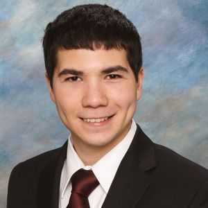
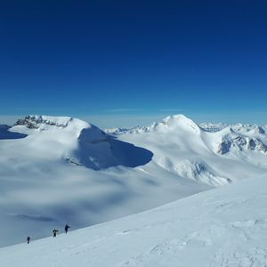

<h1>Chemist</h1>

I work at <a href="https://www.ucalgary.ca/acwa/">ACWA</a> developing analytical methods to measure emerging contaminants in the environment. My current focus is a GC-MS method to quantify plasticizers in municipal wastewater.

Learn more about my work on <a href="https://www.linkedin.com/in/mtsaowapon/">LinkedIn</a>

---

<h1>Climber</h1>

On the weekend I love exploring the mountains with my friends.

One of my highlights is our trip up <a href="https://athousandhilltops.com/mt-kitchener-and-snow-dome/">Kitchener and Snow Dome</a> at the end of my first backcountry season. I spent the year working hard to gain the technical skills and experience required to plan our very own trip up the Colombia Icefield. There were a lot of crashes and terrifying moments in the process, but it paid off with great memories in spectacular places.

Read more of my adventures at <a href="https://athousandhilltops.com/">athousandhilltops.com</a>

